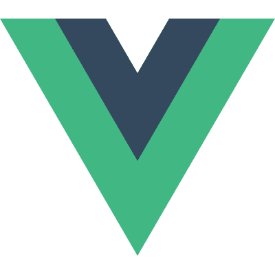

# 愿风裁尘，以心御匠

> 岑安 2017 D2主题分享：前端作为技术人的思考

这个主题一定是一个资深的大前端，才有底气去探讨的。作为一个初入门的小前端，围过来一起思考下，至少让未来的路，少一些迷雾。

## 所谓前端发展历程

前端的发展历程，得益于`HTML+CSS+JS`能力的发展。从web1.0时代的信息展示/数据提交/样式美化到应用时代的MVC/SPA/MVVM及伴随而出的各种工程化工具/模块化概念/异步编程，再到所谓云+端时代的RN/Weex/Nodejs，一切得益于标准的规范化，标准赋予了`HTML+CSS+JS`更强大的能力，前端开发者们拥有了更强大的权利，也就担负起了更多的责任。前端代码也已复杂到前端开发者们不得不采用传统软件工程的开发思路，以更好的管理负担的项目。

## 阶段困境和解法

这里的阶段可以理解为前端发展历程的几个阶段，我更愿意看做是一个前端开发者自身成长的几个阶段。我更愿意从这个分享中读到的，是作为一个渴望成长的前端在每个阶段所要具备的基本要素。

### 后web1.0时代

> WebPage从Hyperlink的本质衍生到ContentProvider的能力

这一阶段的前端开发工种，自身的关注点是在内容提供者（ContentProvider）上的。内容的承载、排版和阅读体验，是这一阶段前端工作的重心，也是一个初级前端的岗位职责：

    1. 基础组件，Tab、Dialog、Slider...
    2. JS功能函数复用，Prototype、Validate、Format...
    3. CSS布局&排版的最佳实践
    4. xhml规范，语义化

虽然叫后Web1.0时代，但是在相当长时间内，这个时代并不会过去，大批入门前端所要面临的第一份挑战依然是如何布局好一个页面，纠结relative和static的区别，JS的数据类型有哪些，原型链是个啥。即便简单易上手如[Vue.js](https://cn.vuejs.org/)，也在起步教程一开始，明确告知：
> 官方指南假设你已了解关于 HTML、CSS 和 JavaScript 的**中级知识**。如果你刚开始学习前端开发，将框架作为你的第一步可能不是最好的主意——掌握好基础知识再来吧！

当然，对于中后台开发者们，借助各种前端开发框架，一样可以做出看起来很漂亮的页面，但那绝不应该是一个有追求的前端开发者所向往的。

### 应用时代 MVC、SPA、MV**

> 从WebPage到WebApp级别的应用时代迫切需要解决的是怎么向传统软件工程靠拢

这一阶段的核心问题在于如何向传统软件工程靠拢，而产生这个问题的原因就是应用时代的前端项目复杂度从Weboage升级到了Webapp级别。这个时代的关键词是框架、工程化、富交互和性能。

    1. 从JQ到MV*、MV**
    2. 模块化规范，CommonJs、AMD、CMD、ES6
    3. 前端工程化，包管理、研发全流程、部署能力、工程化服务
    4. 应用富交互，互动、可视化

这一阶段，提到了框架、模块、工程化和性能，私以为这一阶段才是一个前端开发者真正成长的阶段。深究框架、模块和性能，掌握工程化开发流程，才算真的入了前端的门。

### 云 + 端

> 无线崛起+泛NodeJs时代怎么回归技术服务业务本身

研发模式、云计算、面向五新

    1. 万物上云之后的中后台能力 + 开发者服务能力
    2. 端同意+泛Node带来的的研发模式和组织的重组
    3. 新零售的线下场景，大LBS、IOT
    4. 新金融、新制造、新技术、新能源

以目前个人理解，中后台开发能力、开发者服务能力、研发模式和组织的重组，为新的业务需求提供技术方案，这些依赖技术的扩展和积淀带来的能力，才是大前端真正进阶之路。

此阶段亦可以理解为回归技术，服务业务。岑安老师分享中提到的一点，从业务到技术的思考路径，在这一阶段必不可少：

    1. 需求和项目分阶段，连成线来看
    2. 从过去的状态和问题推导下一阶段业务方向
    3. 从下一阶段的业务挑战推导技术挑战
    4. 从技术挑战拆解项目技术

这一思考路径，对于整个技术架构的组织和分解有着不可或缺的参考意义。

## 关于“思考”

从分享一开始，我看到的就是一个前端成长的各个阶段。那就有必要思考一下，现在的我在哪个阶段，在各个阶段如何有效的成长。

### 入门

这一阶段对应着前面的后Web1.0时代。HTML+CSS+JS是绕不过去的坎，relative和static，原型链作用域闭包，也都是不得不弄明白的东西。这个阶段，有深有浅，浅了也能干活，但往后走，又不得不回来，[W3C标准](https://www.w3.org/)来回翻，[浏览器工作原理](https://www.html5rocks.com/zh/tutorials/internals/howbrowserswork/)各种查。这一阶段可长可短，长了后期好理解，短了后期还得回来补。

### 成长

这阶段对应着应用时代。也是我一段时间来一直迷茫和纠结的阶段，开头提到的迷雾，也是我在这个阶段遭遇到的迷雾，该学点什么，不会的太多，要学的实在太多。趁机思考，也算是列一下近期的学习计划和重点。

    1. 基础回炉：夯实基础很必要，比如JS基础之数据类型、HTTP基础、服务器基础理解、浏览器工作原理基础、性能分析及优化等等
    2. 原理探究：设计模式的学习与理解，比如VisulaDOM实现思路、VisulaDOM的Diff思路、CommonJs模块化实现
    3. 代码分析：高效、易读代码与代码组织及设计思路的理解
    4. ES6实践：熟悉ES6开发习惯，更深入理解状态机、Promise、Async/Await等应用场景
    5. 工程化工具：比如WebPack进行更复杂的场景配置
    6. 其他前端理念实现的思路与简单实践，部分新技术的简单实践
    7. 常见业务场景模拟与实现及分析

### 未来

云 + 端。站在眼前的高度，做好眼前成长这些事就好。

未来再去思考吧。也许久了，会有新的看法，但目前，这些才是真的重要的。