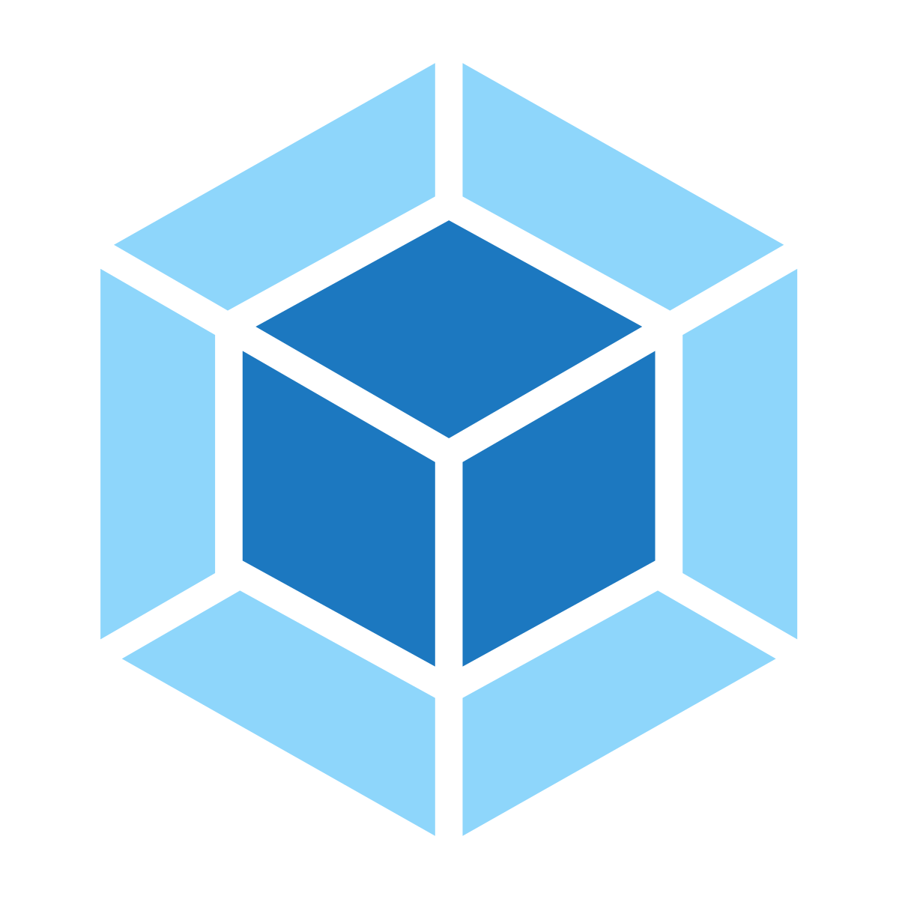

这段时间折腾了一个小小的练手项目，前端采用 + 组织和构建代码，服务端用的 + 。目的在踩踩坑，熟悉一下Vue+Webpack的开发模式，尝试理解一些服务端的概念和思想。前几天去D2听了分享，忽的觉得目前自己更应该纠结一下前端基础与原理的东西。在工具上太耗费时间不是目前该有的状态。就以此暂做一个小结与回顾，接下来方向暂转到前端基础、原理与设计模式学习。

项目本身很简单，代码量也不多。只是实现了最简单的一些功能，包括：

- 登录、登录态保存、退出登录、注册
- 一个简单的爬虫，爬取一天内发布的，工作经验1~3年的会计招聘岗位及公司、规模、薪资等信息，可以查看详情和收藏
- gitbook，可以自动监听提交到github的关于Book仓库的的push，服务器端会自动拉取最新代码，成功后会运行`gitbook build`命令自动构建，更新成功和构建成功都会发送邮件到个人邮箱告知结果

过程中涉及到了很多东西，比如前端页面的代码组织、Vue、Webpack的配置，git的使用、服务端简单的防火墙配置、Mongodb的安装和配置和使用、Redis的安装配置和使用、Koa2及相关全家桶的使用和配置、服务端结构目录组织等等。踩坑、扩展、学习、使用。记得的不多了，但是坑踩了，再慢慢回顾做个记录也是个成长。