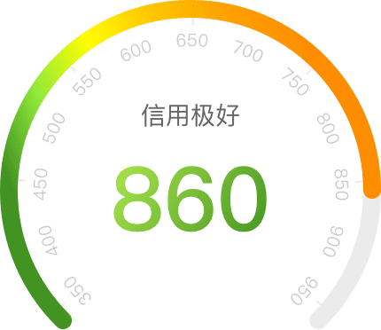

# 实现一个仪表盘进度条

## 实现下图效果

  

- 要求
  1. 实际分数和刻度对应
  2. 350-550[2色渐变]；550-600[3色渐变]；600-650[4色渐变]；650-700[5色渐变]；700以上[6色渐变]
  3. 渐变起始位置为刻度表起始位置，终点位置为分数终点
  4. 其他简单的要求，比如字体颜色渐变啥的，就不列出来了

## 分析与思考

上面那些要求，是我拿到图后分解后的几个要求，由于分数是动态的，因此这里肯定不能采用png的方式实现，考虑了svg。

- 仪表盘的刻度太复杂，直接使用原稿导出svg，灰色的仪表盘和渐变色进度条用path单独写

- 渐变色采用`<defs>`定义渐变，然后进度条引用填充

- `<defs>`定义渐变的实现
  - 页面用的vue实现，，就采用computed属性，不同分计算出`creditLevel`，`v-if`分别添加不同的渐变色
  - `offset`偏移量采用均匀偏移
  - `linearGradient`的起始(x1, y1)是拿起始点坐标位置和整个svg宽高作比例计算出来
  - `linearGradient`的终点位置计算当前分数所在坐标位置，然后和整个svg宽高作比例计算出来，计算方式在下文

```html
<defs>
    <linearGradient id="J_progress_fill" gradientUnits="objectBoundingBox" x1="0.16" y1="0.97" :x2="endPosition.x" :y2="endPosition.y">
        <stop offset="0" stop-color="#429321"/>
        <stop :offset="1/(creditLevel + 1)" stop-color="#91E93B"/>
        <stop v-if="creditLevel > 0" :offset="2/(creditLevel + 1)" stop-color="#FFFE00"/>
        <stop v-if="creditLevel > 1" :offset="3/(creditLevel + 1)" stop-color="#FFC700"/>
        <stop v-if="creditLevel > 2" :offset="4/(creditLevel + 1)" stop-color="#FFA300"/>
        <stop v-if="creditLevel > 3" offset="1" stop-color="#FF8D00"/>
    </linearGradient>
</defs>
```

- 计算当前分数所在的坐标位置
  - 首先明确仪表盘的一些数据，半径(205)、中心点坐标(215,215)，弧长(940)，圆弧宽高(430,370)
  - 首先明确，当前刻度表示350-950，正中的位置就是650，所以650位置坐标就是(215,0)
  - 通过计算得分与650形成的夹角，加正弦余弦，计算当前得分点的坐标

```javascript
    endPosition(){
        /*
            650为12点钟位置刻度，计算偏离12点钟的角度来计算终点坐标
            最终返回的(x,y)为进度条填充的渐变的终点
        */
        var _angle = (this.score - 650) / 822 * 360 / 180 * Math.PI;
        var _x = Math.sin(_angle) * 205 + 215;
        var _y = 215 - Math.cos(_angle) * 205;
        return {
            x: _x / 430,
            y: _y / 370
        }
    }
```